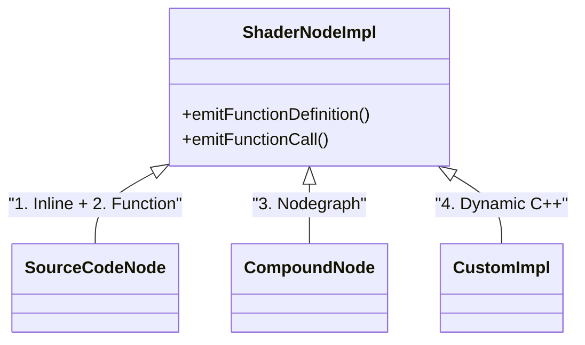
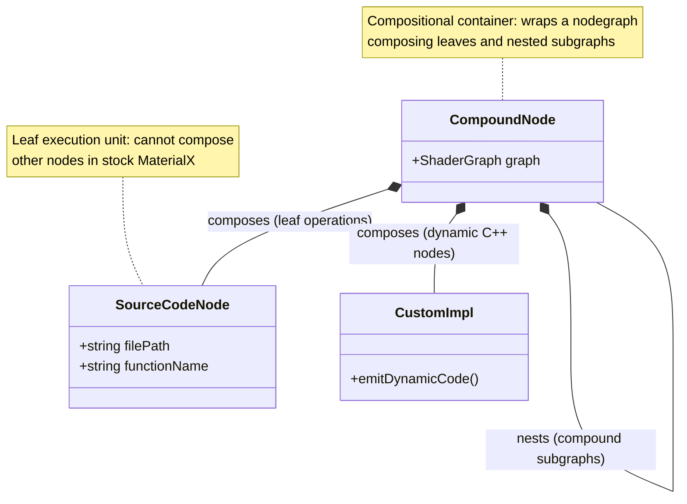
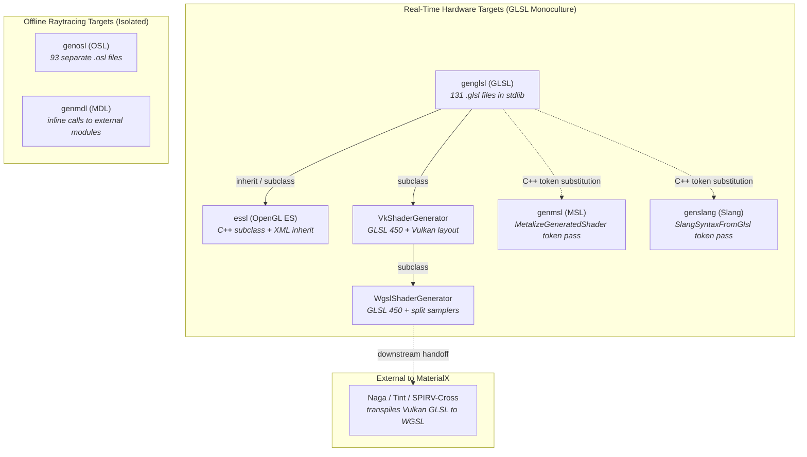

# metashade.mtlx

This package integrates Metashade with [MaterialX](https://github.com/AcademySoftwareFoundation/MaterialX). It aims to extend MaterialX's nodegraph-centric codegen and provide the following benefits:
* a single-source mechanism for implementing source code nodes for diverse target languages;
* flexible control flow, impossible or hard to express in node graphs;
* metaprogramming, enabling optimization.

## MaterialX architecture recap

In MaterialX, **node definitions**, represented by the `NodeDef` C++ class and serialized as `<nodedef>` XML elements, define the interface of nodes of a given type from the perspective of node graphs and visual editors (category names, input/output port names, types, and default values).

The actual code generation logic is defined in separate **node implementation** declarations:
* In the **document model**, implementations are serialized as either `<implementation>` (C++ `Implementation`) or `<nodegraph>` (C++ `NodeGraph`).
* In the **shader generator**, these declarations are bound to C++ classes derived from `ShaderNodeImpl` (such as `SourceCodeNode` for static files/inlines, `CompoundNode` for subgraphs, or custom C++ classes).

Crucially, **Implementations reference NodeDefs, not the other way around**, which makes it possible to override implementations without modifying upstream node definitions.

### MaterialX Node Implementation Code Generation mechanisms

In order to understand how Metashade's codegen can integrate with MaterialX's, let's first discuss how MaterialX generates code for individual nodes.

MaterialX uses [4 different codegen approaches](https://github.com/AcademySoftwareFoundation/MaterialX/blob/main/documents/DeveloperGuide/ShaderGeneration.md#13-node-implementations):

1. **Inline Expression** — The node implementation is specified as a simple inline expression directly in the node definition. This is used for straightforward operations that can be expressed in a single line (e.g., `{{in1}} + {{in2}}` for an add node). The expression uses the target shading language syntax with input ports wrapped in double curly brackets.

2. **Shading Language Function** — The node is implemented as a function written in the target language (GLSL, OSL, etc.), with the source code stored in a separate file. The function signature matches the nodedef's interface of typed inputs and outputs.

3. **Nodegraph Implementation** — The node is implemented as a compound nodegraph composed of other nodes. This is useful for creating reusable compound operations or compatibility graphs for unknown/proprietary nodes.

4. **Dynamic Code Generation (C++)** — A C++ class derived from `ShaderNodeImpl` handles the implementation, emitting code programmatically during shader generation. This is used when static source code isn't sufficient — for example, when code needs to be customized based on node parameters, or when vertex streams and uniforms need to be created dynamically.

### Key Implementation Classes

The following diagram shows how the four code generation methods map to `ShaderNodeImpl` subclasses:

### Composition of Node Implementation Types

Beyond the class hierarchy, it is essential to understand how these implementations **compose** with one another in stock MaterialX during shader generation.

In stock MaterialX, the composition landscape is governed by clear roles:

* `CompoundNode` (`<nodegraph nodedef="...">`) encapsulates an internal `ShaderGraph`. It can recursively contain and instantiate other `CompoundNode`s as well as leaf `SourceCodeNode`s and `CustomImpl` nodes.

* `SourceCodeNode` (`<implementation file="..." function="...">`) emits a function call or inline code snippet directly into the shader output. In stock MaterialX, **source code nodes are strictly leaves in the shader DAG**: they have no internal `ShaderGraph` and cannot wrap other nodes.

### Target Shading Languages and Code Generation Landscape

While `NodeDef`s define an abstract interface across the ecosystem, MaterialX does not have a unified, cross-language compiler for source code nodes. Instead, code generation targets are divided into a **GLSL-centric real-time cluster** and **isolated offline raytracing targets**:

#### 1. The Real-Time Hardware Cluster (GLSL Monoculture)

Rather than maintaining separate shading libraries for each real-time shading language, MaterialX treats GLSL as the primary source of truth:

* **GLSL (`genglsl`)**: The base hardware target implemented by `GlslShaderGenerator`. Standard libraries contain 131 `.glsl` source files.
* **OpenGL ES (`essl`)**: Inherits from `genglsl` in XML target definitions (`<targetdef name="essl" inherit="genglsl" />`) and subclasses `GlslShaderGenerator` in C++, adjusting version directives and precision qualifiers.
* **Vulkan GLSL (`VkShaderGenerator`)**: A C++ subclass of `GlslShaderGenerator` emitting `#version 450` Vulkan GLSL with explicit descriptor sets and binding locations.
* **WGSL (`WgslShaderGenerator`)**: A 68-line C++ subclass of `VkShaderGenerator`. It does **not** emit WGSL syntax; it generates Vulkan GLSL 450 with split texture and sampler bindings (`texture2D name_texture, sampler name_sampler`), relying on downstream tools outside MaterialX (such as Naga or Tint) to transpile the resulting shader to WGSL.
* **Metal Shading Language (`genmsl`)**: Targets inherit from `genglsl` in XML and point directly to `.glsl` files. After emitting the shader stages, `MslShaderGenerator` runs `MetalizeGeneratedShader()`—a C++ post-processing pass that rewrites parameter references (`out/inout Type` to `thread Type &`) and performs string-token replacements (`vec*` to `float*`, `mat4` to `float4x4`, `sampler2D` to `MetalTexture`, `dFdx/dFdy` to `dfdx/dfdy`).
* **Slang (`genslang`)**: Similarly inherits from `genglsl` in XML (`<targetdef name="genslang" inherit="genglsl" />`) and reuses standard `.glsl` files directly. After stage emission, `SlangShaderGenerator` runs `SlangSyntaxFromGlsl()`, a token-replacement pass converting GLSL intrinsics to Slang/HLSL syntax (`mix` to `lerp`, `fract` to `frac`, `vec*` to `float*`), along with ad-hoc workarounds for specific GLSL shaders (e.g. replacing `const float` with `static const float`).

#### 2. The Offline Raytracing Targets (Isolated)

Offline rendering targets share no code with the real-time cluster:

* **OSL (`genosl`)**: Implemented via `OslShaderGenerator` (subclassing `ShaderGenerator`). It is completely independent and requires 93 dedicated, handwritten `.osl` files in the standard library.
* **MDL (`genmdl`)**: Implemented via `MdlShaderGenerator` (subclassing `ShaderGenerator`). It does not use standalone source files in the repository, instead emitting inline expressions that invoke external `materialx::stdlib` MDL modules.

#### 3. The Multi-Target Authoring Burden

Because MaterialX lacks a cross-language abstraction for source code nodes, writing a new leaf node presents an authoring dilemma:
* To support real-time renderers, you must write GLSL—and hope that the string-replacement passes in `genmsl` and `genslang` correctly handle your code idioms without choking.
* To support offline renderers, you must manually rewrite the exact same logic in OSL (and MDL), maintaining multiple disjoint implementations over time.

---

## How Metashade Integrates

Metashade integrates with MaterialX primarily at the source code implementation level, with support for companion nodegraph wiring and design-time specialization:

### 1. Leaf Level: Source Code Nodes

Authoring complex shading models directly as handwritten GLSL files is error-prone, while expressing them as pure XML nodegraphs can quickly become unwieldy.

Metashade allows authoring leaf node logic in Python and compiling it into target source code (such as GLSL) along with the corresponding MaterialX `<implementation>`. For example, `metashade_standard_surface_bsdf` implements the multi-lobe evaluation of standard surface in Python.

### 2. Source Code Node Acquisition (`acquire_function`)

To avoid reimplementing standard library functions, Metashade provides a reflection mechanism:

`acquire_function()` inspects upstream MaterialX `NodeDef` and `Implementation` declarations and exposes them as callable Python functions. For example, it can acquire `ND_oren_nayar_diffuse_bsdf` and `ND_dielectric_bsdf`, translating typed arguments, `ClosureData`, and `inout` parameters so they can be invoked directly from Metashade code, while automatically tracking required `#include` headers.

### 3. Re-implementing Standard Surface

To integrate with existing pipelines, the generated BSDF implementation can override the stock standard surface definition:

1. Metashade generates the leaf BSDF source code node (`metashade_standard_surface_bsdf`).
2. A companion compound `<nodegraph>` (`NG_metashade_standard_surface`) exposes the `ND_standard_surface_surfaceshader` interface, instantiates the leaf BSDF node, and connects its output to `ND_surface`.

Because MaterialX implementations reference NodeDefs, this cleanly overrides the stock implementation without modifying upstream definitions.

### 4. Design-Time Permutations (Lobe Pruning)

Metashade supports generating specialized shader variants at design time via the `Permutation` configuration:
* For variants with disabled lobes (such as `subsurface=False`), dead code branches and acquired function calls are stripped from the generated source code.
* Unused inputs (such as subsurface parameters) are omitted from the node definition and nodegraph, and unneeded `#include` headers are dropped.

This reduces shader code size and avoids unnecessary GPU resource usage.

### 5. Single-Source Multi-Target Authoring

By authoring node logic in Python, Metashade provides the missing single-source mechanism for leaf implementations. Instead of maintaining separate GLSL and OSL codebases or relying on fragile string search-and-replace passes, developers can express shader math once in Python and compile clean, idiomatic target code for diverse backends.

