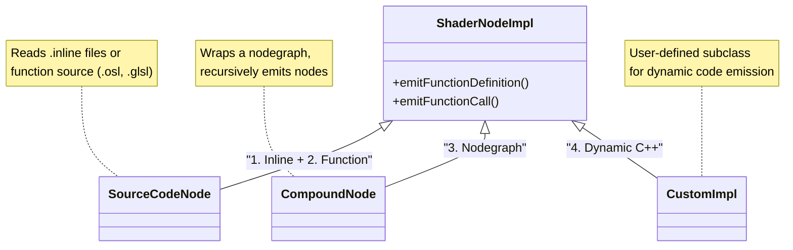
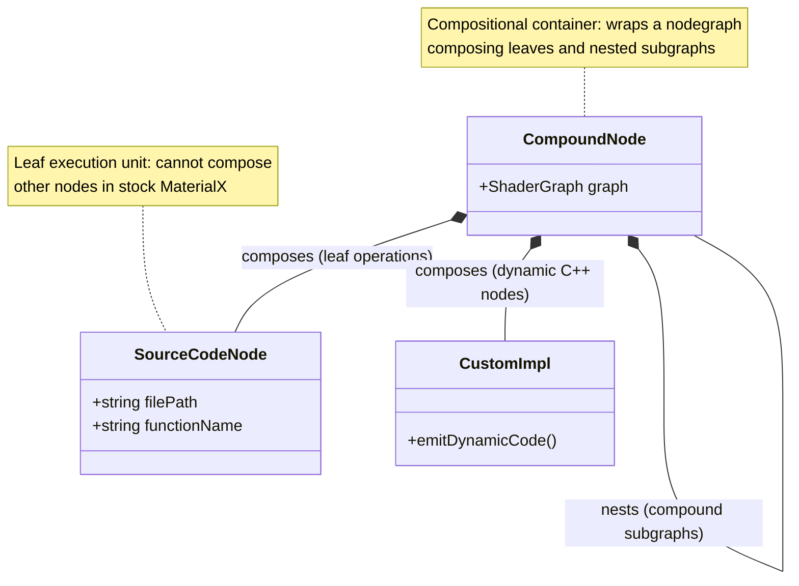

# metashade.mtlx

This package integrates Metashade with [MaterialX](https://github.com/AcademySoftwareFoundation/MaterialX). It aims to extend MaterialX's nodegraph-centric codegen and provide the following benefits:
* a single-source mechanism for implementing source code nodes for diverse target languages;
* flexible control flow, impossible or hard to express in node graphs;
* metaprogramming, enabling optimization.

## MaterialX architecture recap

In MaterialX, **node definitions**, represented by the `NodeDef` C++ class and serialized as `<nodedef>` XML elements, define the interface of nodes of a given type from the perspective of node graphs and visual editors (category names, input/output port names, types, and default values).

The actual code generation logic is defined in separate **node implementation** declarations:
* In the **document model**, implementations are serialized as either `<implementation>` (C++ `Implementation`) or `<nodegraph>` (C++ `NodeGraph`).
* In the **shader generator**, these declarations are bound to C++ classes derived from `ShaderNodeImpl` (such as `SourceCodeNode` for static files/inlines, `CompoundNode` for subgraphs, or custom C++ classes).

Crucially, **Implementations reference NodeDefs, not the other way around**, which makes it possible to override implementations without modifying upstream node definitions.

### MaterialX Node Implementation Code Generation mechanisms

In order to understand how Metashade's codegen can integrate with MaterialX's, let's first discuss how MaterialX generates code for individual nodes.

MaterialX uses [4 different codegen approaches](https://github.com/AcademySoftwareFoundation/MaterialX/blob/main/documents/DeveloperGuide/ShaderGeneration.md#13-node-implementations):

1. **Inline Expression** — The node implementation is specified as a simple inline expression directly in the node definition. This is used for straightforward operations that can be expressed in a single line (e.g., `{{in1}} + {{in2}}` for an add node). The expression uses the target shading language syntax with input ports wrapped in double curly brackets.

2. **Shading Language Function** — The node is implemented as a function written in the target language (GLSL, OSL, etc.), with the source code stored in a separate file. The function signature matches the nodedef's interface of typed inputs and outputs.

3. **Nodegraph Implementation** — The node is implemented as a compound nodegraph composed of other nodes. This is useful for creating reusable compound operations or compatibility graphs for unknown/proprietary nodes.

4. **Dynamic Code Generation (C++)** — A C++ class derived from `ShaderNodeImpl` handles the implementation, emitting code programmatically during shader generation. This is used when static source code isn't sufficient — for example, when code needs to be customized based on node parameters, or when vertex streams and uniforms need to be created dynamically.

### Key Implementation Classes

The following diagram shows how the four code generation methods map to `ShaderNodeImpl` subclasses:

### Composition of Node Implementation Types

Beyond the class hierarchy, it is essential to understand how these implementations **compose** with one another in stock MaterialX during shader generation.

In stock MaterialX, the composition landscape is governed by clear roles:

* **`CompoundNode` (`<nodegraph nodedef="...">`) — The Compositional Container:**
  A compound node encapsulates an internal `ShaderGraph`. It can recursively contain and instantiate other `CompoundNode`s (forming nested compound hierarchies) as well as leaf `SourceCodeNode`s and `CustomImpl` nodes. During shader generation, MaterialX's `ShaderGraph` traverses this hierarchy, resolving port dependencies and ordering operations into a linear execution schedule.

* **`SourceCodeNode` (`<implementation file="..." function="...">`) — The Leaf Execution Unit:**
  A source code node emits a function call or inline code snippet directly into the shader output. In stock MaterialX, **source code nodes are strictly leaves in the shader DAG**: they have no internal `ShaderGraph` and cannot instantiate, wrap, or compose other nodes.

---

## How Metashade Integrates

Metashade integrates with MaterialX primarily at the source code implementation level, with support for companion nodegraph wiring and design-time specialization:

### 1. Leaf Level: Source Code Nodes

Authoring complex shading models directly as handwritten GLSL files is error-prone, while expressing them as pure XML nodegraphs can quickly become unwieldy.

Metashade allows authoring leaf node logic in Python and compiling it into target source code (such as GLSL) along with the corresponding MaterialX `<implementation>`. For example, `metashade_standard_surface_bsdf` implements the multi-lobe evaluation of standard surface in Python.

### 2. Source Code Node Acquisition (`acquire_function`)

To avoid reimplementing standard library functions, Metashade provides a reflection mechanism:

`acquire_function()` inspects upstream MaterialX `NodeDef` and `Implementation` declarations and exposes them as callable Python functions. For example, it can acquire `ND_oren_nayar_diffuse_bsdf` and `ND_dielectric_bsdf`, translating typed arguments, `ClosureData`, and `inout` parameters so they can be invoked directly from Metashade code, while automatically tracking required `#include` headers.

### 3. Re-implementing Standard Surface

To integrate with existing pipelines, the generated BSDF implementation can override the stock standard surface definition:

1. Metashade generates the leaf BSDF source code node (`metashade_standard_surface_bsdf`).
2. A companion compound `<nodegraph>` (`NG_metashade_standard_surface`) exposes the `ND_standard_surface_surfaceshader` interface, instantiates the leaf BSDF node, and connects its output to `ND_surface`.

Because MaterialX implementations reference NodeDefs, this cleanly overrides the stock implementation without modifying upstream definitions.

### 4. Design-Time Permutations (Lobe Pruning)

Metashade supports generating specialized shader variants at design time via the `Permutation` configuration:
* For variants with disabled lobes (such as `subsurface=False`), dead code branches and acquired function calls are stripped from the generated source code.
* Unused inputs (such as subsurface parameters) are omitted from the node definition and nodegraph, and unneeded `#include` headers are dropped.

This reduces shader code size and avoids unnecessary GPU resource usage.

